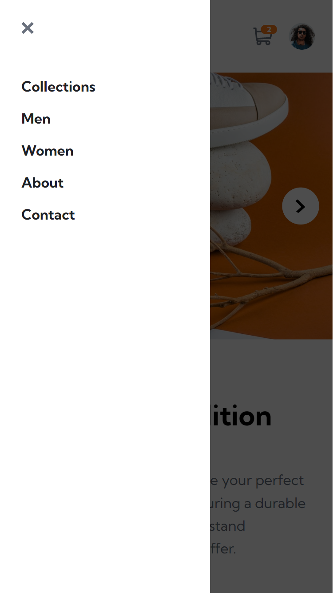
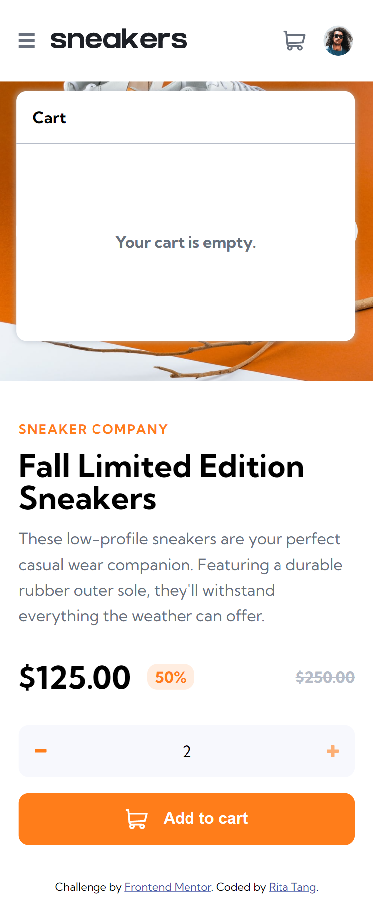
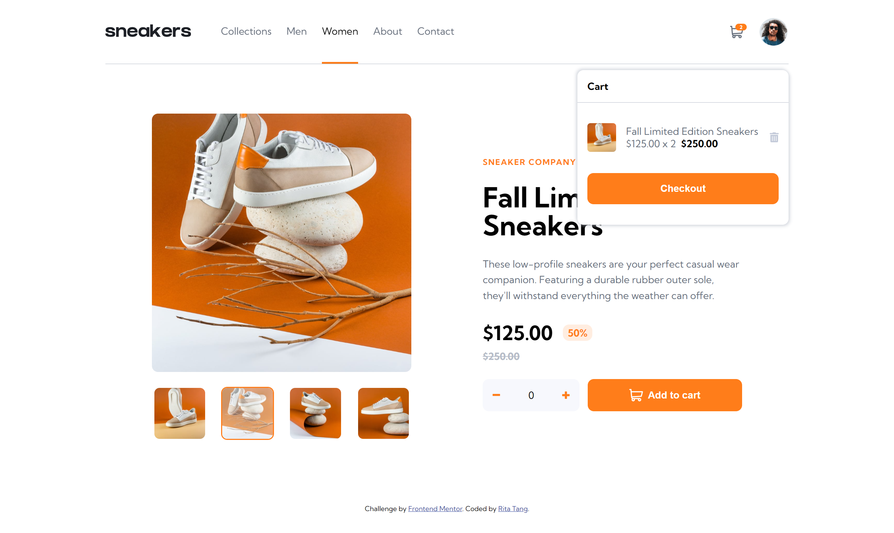
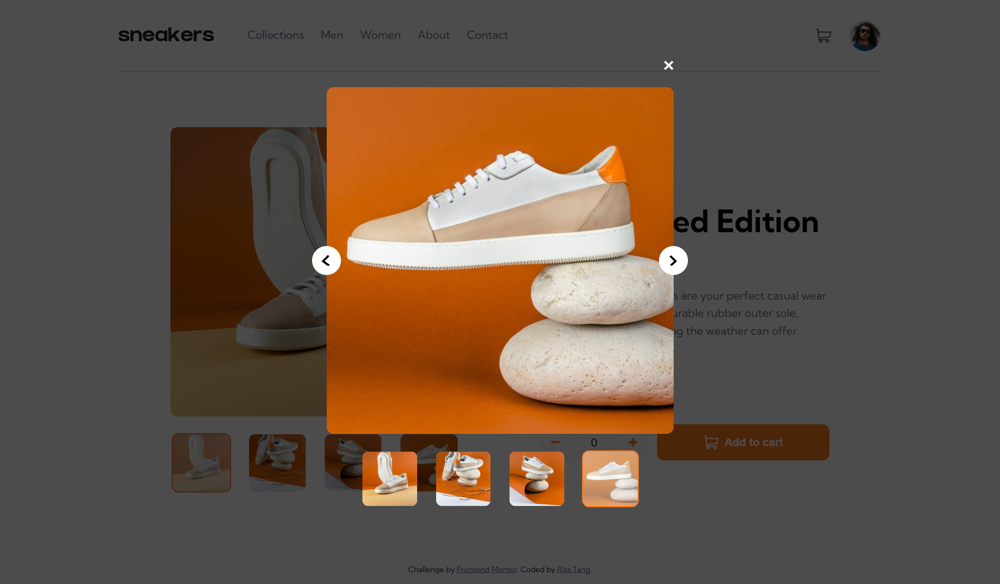

# Frontend Mentor - E-commerce product page solution

This is a solution to the [E-commerce product page challenge on Frontend Mentor](https://www.frontendmentor.io/challenges/ecommerce-product-page-UPsZ9MJp6).

## Table of contents

- [Overview](#overview)
  - [The challenge](#the-challenge)
  - [Screenshot](#screenshot)
  - [Links](#links)
- [My process](#my-process)
  - [Built with](#built-with)
  - [What I learned](#what-i-learned)

<hr>

## Overview

### The challenge

The challenge is to build out the project and get it looking as close to the designs inside the `/design` folder as possible. Users should be able to:

- View the optimal layout for the site depending on their device's screen size
- See hover states for all interactive elements on the page
- Open a lightbox gallery by clicking on the large product image
- Switch the large product image by clicking on the small thumbnail images
- Add items to the cart
- View the cart and remove items from it

<br/>

### Screenshot

<details>
<summary style=cursor:pointer><u>Mobile design</u></summary>



</details>

<details>
<summary style=cursor:pointer><u>Desktop design</u></summary>
  
  
</details>

<br/>

### Links

- Solution URL: [Here](https://github.com/ritatanght/ecommerce-product-page/)
- Live Site URL: [Here](https://ritatanght.github.io/ecommerce-product-page/)

<hr>

## My process

### Built with

- Semantic HTML5 markup
- CSS custom properties
- Flexbox
- CSS Grid
- Mobile-first workflow

### What I learned

`window.matchMedia()` works like a media query in CSS but in the context of Javascript

- `.matches` is one of the keys in the MediaQueryList object returned from this method, its value would either be `true` or `false`

```js
// To check whether the screen width matches, so as to apply code
let wideScreenWidth = window.matchMedia("(min-width: 750px)");

if (wideScreenWidth.matches) {
  // [... CODE HERE...]
}
```

<br/>

The following method allows the Array indexOf() method to be used on NodeList, it returns the index of an element in the NodeList.

```js
Array.prototype.indexOf.call(NodeList, element);
```
